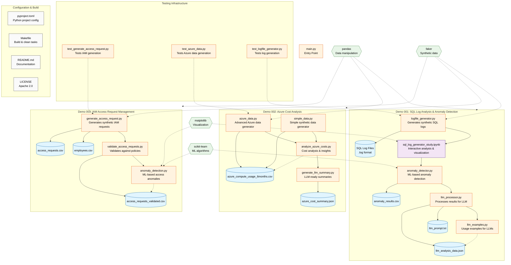

# AI Demos - Architecture Block Diagram

## Overview
This repository contains three AI demonstration workflows for different use cases: SQL Log Analysis, Azure Cost Analysis, and IAM Access Request Management.

## System Architecture

## Data Flow Summary

### Demo 001: SQL Log Analysis
1. **logfile_generator.py** creates synthetic SQL server logs
2. **sql_log_generator_study.ipynb** provides interactive analysis and visualization
3. **anomaly_detector.py** uses ML (Isolation Forest) to detect anomalies in logs
4. **llm_processor.py** formats anomaly results for LLM consumption
5. **llm_examples.py** demonstrates various ways to feed data to LLMs

**Output Files:**
- SQL log files (.log format)
- `anomaly_results.csv` - Detected anomalies with scores
- `llm_prompt.txt` - Ready-to-use prompts for LLMs
- `llm_analysis_data.json` - Structured data for LLM APIs

### Demo 002: Azure Cost Analysis
1. **simple_data.py** OR **azure_data.py** generate synthetic Azure usage data
2. **analyze_azure_costs.py** performs cost analysis and identifies optimization opportunities
3. **generate_llm_summary.py** creates LLM-ready summaries for cost optimization

**Output Files:**
- `azure_compute_usage_6months.csv` - 6 months of Azure usage data
- `azure_cost_summary.json` - Structured summary for LLM analysis

### Demo 003: IAM Access Request Management
1. **generate_access_request.py** creates synthetic employees and access requests
2. **validate_access_requests.py** validates requests against security policies
3. **anomaly_detection.py** uses ML to detect unusual access patterns

**Output Files:**
- `employees.csv` - Synthetic employee database
- `access_requests.csv` - Generated access requests
- `access_requests_validated.csv` - Validated requests with risk assessments

## Key Dependencies

- **pandas**: Data manipulation and CSV handling across all demos
- **scikit-learn**: Machine learning for anomaly detection (Isolation Forest, TF-IDF)
- **faker**: Generating realistic synthetic data (names, dates, etc.)
- **matplotlib/seaborn**: Data visualization (primarily in notebooks)

## Testing Strategy

Each major component has corresponding unit tests in the `tests/` directory that validate data generation, processing logic, and output format integrity.

## Build System

- **Makefile**: Provides commands for setup, testing, cleaning, and dependency management
- **pyproject.toml**: Python project configuration with dependencies and metadata